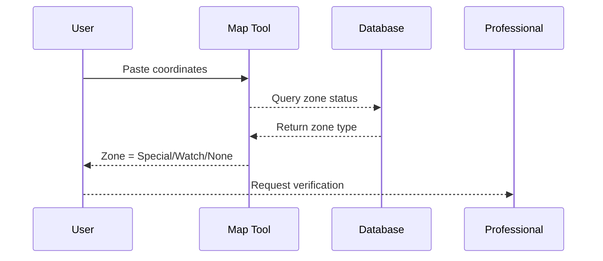

<!-- 🏷️ イントロ -->
> **TL;DR**  
> Since 2024, foreign buyers must **file a notification 2 weeks prior** to acquiring land within a Special Attention Zone.  
> Skipping this step can lead to fines up to **¥1 million**.

`<!-- excerpt-end -->`

### 1. What Is a Special Attention Zone?

Japan's "Important Land & Property Act" (重要土地等調査法) introduced two designations designed to monitor and control land ownership near sensitive facilities:

| Designation            | Purpose                                 | Current Count |
|------------------------|-----------------------------------------|--------------|
| ⛰️ **Watch Zone**      | Monitor sensitive areas near bases      | 332          |
| 🚫 **Special Zone**    | Stricter review, pre-purchase notice    | 251          |

#### Key Differences

**Watch Zones** require post-purchase reporting and allow government monitoring of land use activities. They're designed as early warning systems around defense facilities.

**Special Attention Zones** require **advance notification** before any foreign entity can purchase land. The government has 30 days to review and potentially block the transaction.

### 2. How to Check If Your Plot Falls Inside a Zone

The government provides several tools to verify zone status, but the process can be complex for non-Japanese speakers.

#### Official Government Resources

1. **Grab the coordinates** of your land pin using Google Maps or GPS
2. **Download the official KML file** from the Cabinet Office website
3. **Use GIS software** like QGIS to overlay your property location
4. **Cross-reference** with municipal zoning maps

#### Simplified Verification Process

For a quick check, you can:

**Pro Tip**: Always get professional verification before proceeding with any purchase. Zone boundaries can be complex and change without notice.

### 3. Filing the Notification – Step-by-Step

The notification process is detailed and requires specific documentation in Japanese.

| Step | Form Required | Submitted To | Lead Time |
|------|---------------|--------------|-----------|
| 1 | 特調法第8条様式第1 | Prefectural Governor | 14 days minimum |
| 2 | Property survey maps | City Hall records | 2-3 days |
| 3 | Translation (JP→EN) | Professional service | 2-5 days |

#### Required Documentation

**Basic Information:**
- Purchaser details (individual or corporate)
- Property location and boundaries
- Intended use of the land
- Purchase timeline and financing details

**Supporting Documents:**
- Official property survey (地積測量図)
- Zoning classification certificate
- Environmental impact assessment (if applicable)
- Corporate structure documents (for companies)

#### Professional Assistance

Our **Full Risk Report** includes complete notification drafting and filing services. This can reduce your lead time by 2 weeks and ensure compliance with all requirements.

[Request a quote →](/contact?service=full)

### 4. Penalties & Real-World Cases

The government has been actively enforcing these regulations since implementation.

#### Recent Enforcement Actions

**March 2025** – A Hong Kong-based investor was fined ¥600,000 for failing to notify before purchasing agricultural land near Misawa Air Base in Aomori Prefecture.

**June 2025** – A proposed purchase near Sasebo Naval Base was blocked after review. The foreign buyer withdrew after government concerns about proximity to submarine facilities.

**September 2025** – First corporate case: A Singaporean development company faced additional scrutiny and a 60-day review period for a hotel project near Yokota Air Base.

#### Enforcement Trends

- **Increased scrutiny** of purchases within 1km of defense facilities
- **Corporate ownership structures** under closer examination  
- **Agricultural land** receiving particular attention
- **Repeat violations** facing escalated penalties

### 5. Strategic Considerations for Foreign Buyers

#### Due Diligence Best Practices

**Before you begin property search:**
1. Identify your target areas and check zone status
2. Understand notification requirements early
3. Budget for additional legal and translation costs
4. Plan for extended timelines (add 4-6 weeks minimum)

**During property evaluation:**
1. Verify zone boundaries with multiple sources
2. Assess government review likelihood
3. Consider alternative properties outside special zones
4. Evaluate long-term regulatory risk

#### Risk Mitigation Strategies

**Documentation Strategy:**
- Maintain detailed records of all compliance efforts
- Use certified translation services
- Keep copies of all government correspondence
- Document intended land use clearly

**Professional Support:**
- Engage local legal counsel familiar with the regulations
- Work with experienced real estate agents
- Consider compliance specialists for complex cases
- Maintain relationships with government liaisons

### Key Takeaways

1. **Always verify zone status** before signing any purchase contract or making deposits

2. **Notification is mandatory** only in Special Attention Zones (🚫), not Watch Zones (⛰️)

3. **Professional guidance** can reduce lead time by 2+ weeks and ensure compliance

4. **Plan ahead** – the notification process adds significant time to property transactions

5. **Budget appropriately** – legal, translation, and professional fees can add ¥200,000-500,000 to your purchase costs

The regulatory landscape continues to evolve, with potential for additional zones and stricter requirements. Staying informed and working with experienced professionals is essential for successful property acquisition in Japan.

<!-- 👇 自動 CTA セクションは BlogLayout で挿入 -->
<!-- FAQ は layout で Accordion に変換 -->